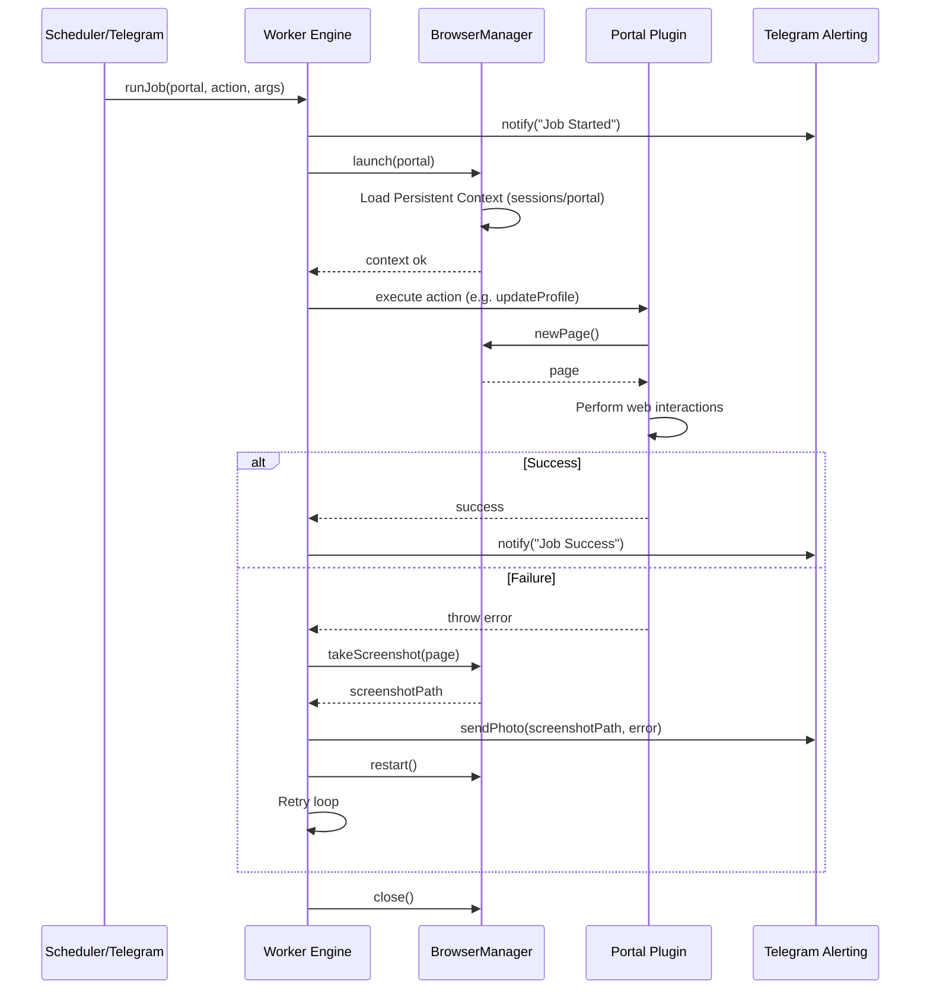

# Platform Architecture

This document describes the design patterns and process flow of the Autonomous Job Automation Platform.

## 🔄 System Flow Diagrams

The orchestration is driven either by the scheduler daemon or the interactive Telegram bot via OpenClaw AI:

## 🏗️ Core Modules

### 1. Browser & Session Isolation
- **`BrowserManager`**: Rather than a shared single browser session, BrowserManager launches persistent browser context directories unique to each portal. This keeps cookies, local storage, and caches isolated.
- **`SessionManager`**: Manages the life cycle of directories in `./sessions/`. It can force a re-login by clearing a folder, or display active profile names.

### 2. Worker Engine (`runJob`)
The worker acts as a robust transactional shell around raw Playwright tasks. Its responsibilities include:
- Execution timing measurements (for performance statistics).
- Automatic error recovery (restarting the browser context upon closures or page freezes).
- Retrying execution blocks up to the defined configuration max retries.
- Taking and saving browser page screenshots on failure states.
- Emitting real-time statuses and failures to Telegram.

### 3. OpenClaw AI Orchestrator
- Integrates with OpenRouter/Gemini to translate arbitrary messages into execution calls.
- Provides regex fallback parsers for reliability when connection issues or missing configuration parameters occur.

### 4. Scheduler
- A cron scheduler running localized to standard time zones to update profiles during high-visibility business hours (morning and afternoon).
